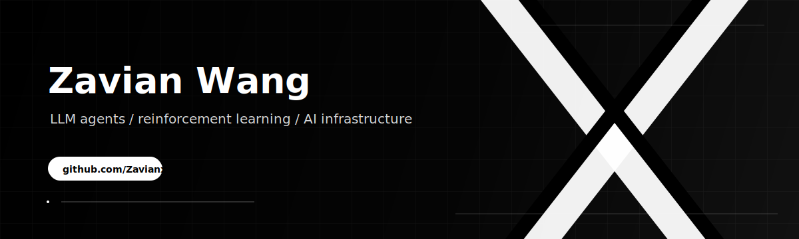

## 👋🏻 Hi, I'm Zavian

LLM researcher focused on reinforcement learning, agent systems, and practical AI infrastructure.

I build systems for agents that remember, coordinate, use tools, and operate in real workflows. I care about turning AI agents from demos into reliable products people can use every day.

---

## ⚙️ Stack

- **AI / Agents:** LLM agents, tool use, memory systems, MCP
- **Languages:** TypeScript, Python
- **Product:** React, human-agent interfaces, automation workflows
- **Research:** Reinforcement learning, evaluation, long-context systems

---

## 🚀 Current Focus

- Reinforcement learning for LLM agents
- Long-running memory and context systems
- Reliable tool use and workflow automation
- Personal AI interfaces

---

## 👾 Contribution Graph

<picture>
  <source
    media="(prefers-color-scheme: dark)"
    srcset="https://raw.githubusercontent.com/Zavianx/Zavianx/output/pacman-contribution-graph-dark.svg"
  />
  <source
    media="(prefers-color-scheme: light)"
    srcset="https://raw.githubusercontent.com/Zavianx/Zavianx/output/pacman-contribution-graph.svg"
  />
  
</picture>

---

## 📌 Projects

Check my pinned repositories below to explore agent systems, personal AI interfaces, and automation tools. Currently contributing to [OpenHuman](https://github.com/tinyhumansai/openhuman).
